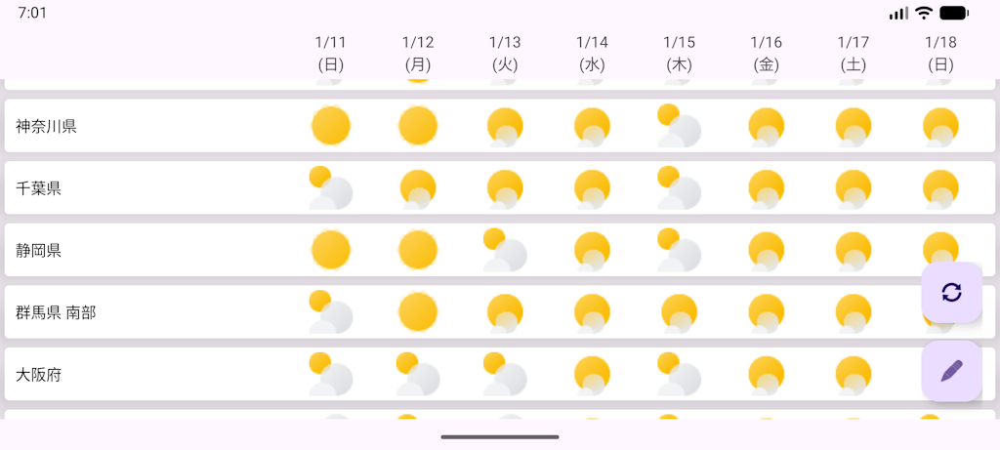

# Forecaster

日本国内の一週間の気象情報を表示します。

# 動作環境

Android 12 Snow Cone 以上

# 使用データについて

本アプリケーションが表示する気象の情報は、気象庁ホームページの以下 URL から取得した情報をもとに加工・利用しています。

- `https://www.jma.go.jp/bosai/common/const/area.json`
- `https://www.jma.go.jp/bosai/forecast/data/forecast/*****.json`
  - `*****` には任意の文字列が入ります。

# 制約

- 予報エリアの編集をやり直すことはできません(将来対応予定)。

# ライセンス

- 本アプリケーションとそのソースコードは [MIT License](LICENSE) により提供されます。
